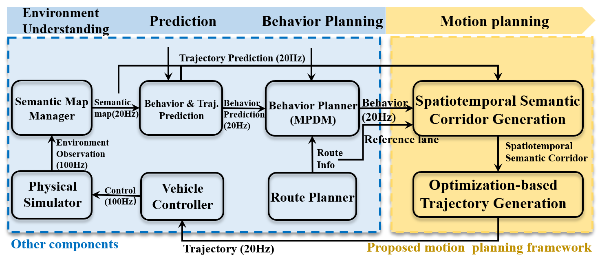

# Spatio-temporal Semantic Corridor

## 0. News

**21 Sept. 2020:** The whole dependencies and a playable demo can be found in: **https://github.com/HKUST-Aerial-Robotics/EPSILON**

**31 August 2019:** The code for the ssc planner is available online!

**3 July 2019:** Our paper is available online!
* **Safe Trajectory Generation for Complex Urban Environments Using Spatio-temporal Semantic Corridor**, Wenchao Ding, Lu Zhang, Jing Chen and Shaojie Shen [IEEE Xplore](https://ieeexplore.ieee.org/document/8740885). *W. Ding and L. Zhang contributed equally to this project.*
```
@article{ding2019safe,
  title={Safe Trajectory Generation for Complex Urban Environments Using Spatio-temporal Semantic Corridor},
  author={Ding, Wenchao and Zhang, Lu and Chen, Jing and Shen, Shaojie},
  journal={IEEE Robotics and Automation Letters},
  year={2019},
  publisher={IEEE}
}
```

**What Is Next:** The code for the dependencies of this planner is comming soon!

## 1. Introduction
This is the project page for the paper **''Safe Trajectory Generation for Complex Urban Environments Using Spatio-temporal Semantic Corridor''** which is published at IEEE Robotics and Automation Letters (RA-L).

This project contains (**already released**):
* ssc_map: maintainer for the semantic elements in the spatio-temporal domain.
* ssc_planner: planner for generating the semantic corridor in the spatio-temporal domain and optimizing safe and dynamically feasible trajectories.
* ssc_server_ros: ros server which manages the replanning.
* ssc_visualizer: visualizing the elements both in the spatio-temporal domain (in a separate rviz window) and in the global coordinate.

The dependencies of this project includes (**comming soon**):
* `common` package: an integration of various mathematical tools such as polynomial, spline, primitive, lane, trajectory, state, optimization solvers, etc. It provides many easy-to-use interfaces for mathematical modeling.
* `phy_simulator` package: a configurable multi-agent simulator. It provides ground truth information and listens planner feedbacks.
* `semantic_map_manager` package: map with semantic information for vehicle local planning. Each agent is capable of rendering its local planning map based on its configuration.
* `vehicle_model` package: basic vehicle models and controllers.
* `vehicle_msgs` package: ros communication messages and corresponding encoder and decoders.
* `playgrounds` package: test cases/configurations/scenarios stored in json format.
* `behavior_planner` package: mpdm behavior planner for on-road driving. It can provide a local reference lane based on navigation information and behavior decision.
* `forward_simulator` package: forward simulation
* `motion_predictor` package: surrounding vehicle motion prediction.
* `route_planner` package: road-level route planner, a simple version.

The dependencies will be released in another repo: **https://github.com/HKUST-Aerial-Robotics/HDJI_planning_core**.

The overall structure is as follows:



**Videos:**

<a href="https://youtu.be/AHosJZ6CITc" target="_blank"></a>

## 2. Prerequisites

## 3. Build

## 4. Usage

## 5. Demos