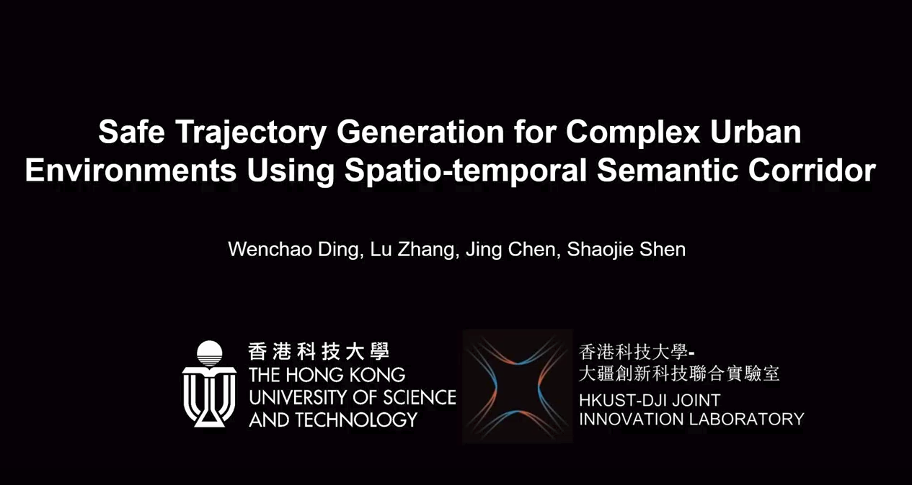

# Spatio-temporal Semantic Corridor

## 0. Introduction
**News:** Apart from this motion planner, the *multi-agent simulator* in the paper is also going to be open-sourced. We are right now working on opening this big project and all the packages are supposed to be released before September.

**3 July 2019:** Our paper is available online!
* **Safe Trajectory Generation for Complex Urban Environments Using Spatio-temporal Semantic Corridor**, Wenchao Ding, Lu Zhang, Jing Chen and Shaojie Shen [IEEE Xplore](https://ieeexplore.ieee.org/document/8740885). *W. Ding and L. Zhang contributed equally to this project.*
```
@article{ding2019safe,
  title={Safe Trajectory Generation for Complex Urban Environments Using Spatio-temporal Semantic Corridor},
  author={Ding, Wenchao and Zhang, Lu and Chen, Jing and Shen, Shaojie},
  journal={IEEE Robotics and Automation Letters},
  year={2019},
  publisher={IEEE}
}
```

**Videos:**
<a href="https://youtu.be/AHosJZ6CITc" target="_blank"></a>

## 1. Prerequisites

## 2. Build

## 3. Usage

## 4. Demos